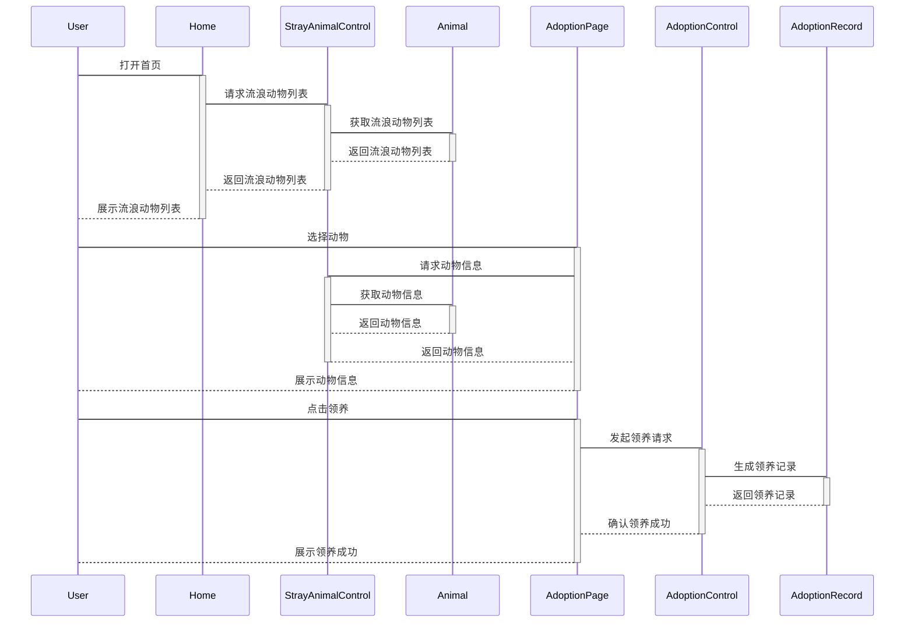

```mermaid
sequenceDiagram
    participant User

    User->Home: 打开首页
    activate Home
    Home->StrayAnimalControl: 请求流浪动物列表
    activate StrayAnimalControl
    StrayAnimalControl->Animal: 获取流浪动物列表
    activate Animal
    Animal-->StrayAnimalControl: 返回流浪动物列表
    deactivate Animal
    StrayAnimalControl-->Home: 返回流浪动物列表
    deactivate StrayAnimalControl
    Home-->User: 展示流浪动物列表
    deactivate Home
    User->AdoptionPage: 选择动物
    activate AdoptionPage
    AdoptionPage->StrayAnimalControl: 请求动物信息
    activate StrayAnimalControl
    StrayAnimalControl->Animal: 获取动物信息
    activate Animal
    Animal-->StrayAnimalControl: 返回动物信息
    deactivate Animal
    StrayAnimalControl-->AdoptionPage: 返回动物信息
    deactivate StrayAnimalControl
    AdoptionPage-->User: 展示动物信息
    deactivate AdoptionPage
    User->AdoptionPage: 点击领养
    activate AdoptionPage
    AdoptionPage->AdoptionControl: 发起领养请求
    activate AdoptionControl
    AdoptionControl->AdoptionRecord: 生成领养记录
    activate AdoptionRecord
    AdoptionRecord-->AdoptionControl: 返回领养记录
    deactivate AdoptionRecord
    AdoptionControl-->AdoptionPage: 确认领养成功
    deactivate AdoptionControl
    AdoptionPage-->User: 展示领养成功
    deactivate AdoptionPage
    
```